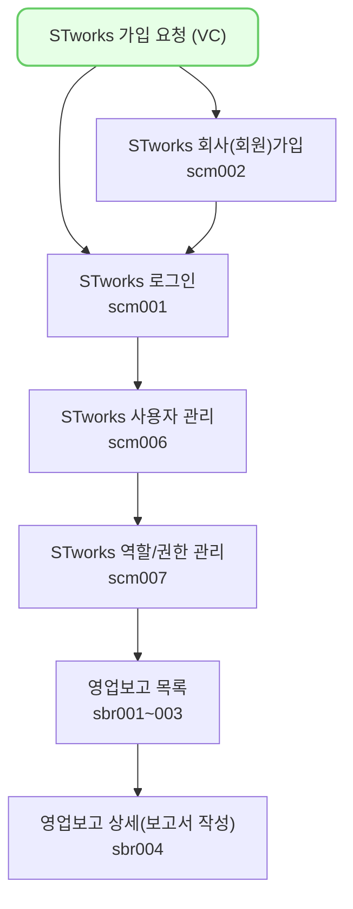

VCworks 사용자가 신규 스타트업(피투자기업)에게 STworks 가입 요청을 보내는 방법입니다. 

## 신규 투자자 STworks 가입 요청하기

1. 투자심의 단계에서 '등기' 단계가 되는 시점에 STworks 가입 요청 메일을 전송할 수 있습니다.
	- 주요연락처에 1개 이상의 이메일이 입력되어 있어야 합니다.
	- `투자/회수 > 투자심의 > 투자심의 상세(vs0003)` 화면에서 가입 요청 메일 전송이 가능합니다.
	
	
2. 가입 요청 메일을 추가로 발송하고 싶을 때는 `주요연락처` 섹션의 [대표계정 등록 메일 재전송] 버튼을 클릭합니다.
	 - ST works 대표 계정 등록 창이 뜨며, [이메일 보내기]를 클릭하면 해당 이메일로 가입 요청 메일이 전송됩니다.
	 
3. `포트폴리오 > 포트폴리오 정보 > 포트폴리오 상세 화면(pm0101)`의 `주요연락처` 섹션의  [대표계정 등록 메일 재전송] 버튼을 클릭해도 가입 요청 메일 전송이 가능합니다.
	
	
4. 가입이 완료된 후에는 STworks 가입 여부가 '여'로 표시됩니다.
	

## 자주 묻는 질문

> 스타트업(피투자기업)에 가입 요청 메일을 보낸 적이 없는데, STworks에 가입되어 있다고 합니다.
{: .prompt-tip }
- 여러 곳의 VC에서 투자를 받는 회사인 경우, VCworks를 사용하는 타 VC에서 STworks 가입 요청을 보내 이미 가입이 되어 있을 수 있습니다. 

> STworks 가입시 국내 법인과 해외 법인의 차이점이 있나요? 
{: .prompt-tip }
- 국내 법인의 경우 VCworks에 등록된 법인등록번호로 STworks에 가입할 수 있습니다.
- 해외 법인의 경우 VCworks에 등록된 법인명으로 STworks에 가입할 수 있습니다.

## 투자자 보고 업무의 일반 흐름

