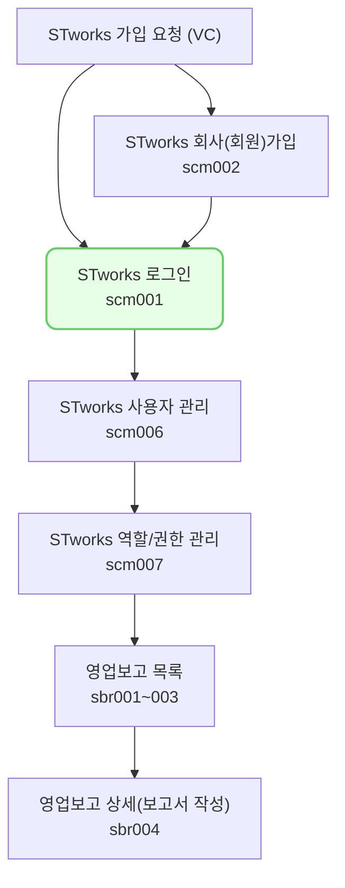

스타트업 웍스에 로그인 하는 절차를 소개하고, 주의사항에 대해 안내합니다.

## 동영상



## 로그인

1\. 회사코드 또는 법인등록번호를 입력해주세요.
- 회사코드를 별도로 설정하지 않으셨거나, 잊어버리신 경우 법인등록번호로 로그인 하실 수 있습니다.
- 법인등록번호는 대시(-)사용 여부 관계 없이 로그인 가능합니다.

2\. 로그인 할 ID를 입력해주세요.

3\. 로그인 할 계정의 비밀번호를 입력해주세요.

4\. [로그인]을 클릭해주세요

## 자주 묻는 질문

> 해외 기업인데 로그인 법인등록번호를 잊어버렸어요.
{: .prompt-tip }
- 로그인 화면 하단의 [문의하기] 버튼을 통해 문의해주세요.

> 신규 입사자 계정을 생성하고 싶어요.
{: .prompt-tip }
- 신규 계정은 관리자 계정으로 로그인 후, 설정 > 사용자 관리 메뉴에서 생성하실 수 있습니다.
- 자세한 설정 방법은 사용자 관리 매뉴얼을 참고해주세요.

## 투자자 보고 업무의 일반 흐름

