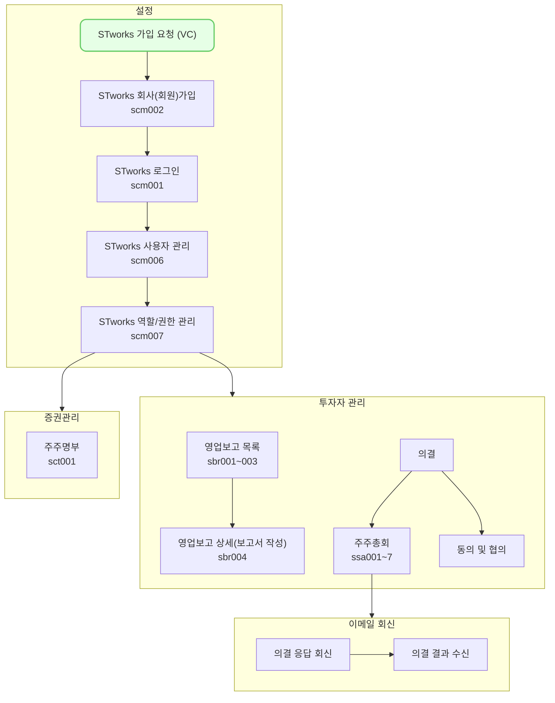

주주명부에서는 우리 회사의 주주명부 및 주주 변동 사항을 관리할 수 있는 방법을 설명합니다.

## 투어 가이드

<div style="position: relative; box-sizing: content-box; max-height: 80vh; max-height: 80svh; width: 100%; aspect-ratio: 1.9607843137254901; padding: 40px 0 40px 0;"><iframe src="https://app.supademo.com/embed/cmfqb84wk0qmz130uqlehqa6w?embed_v=2&utm_source=embed" loading="lazy" title="Stworks Demo" allow="clipboard-write" frameborder="0" webkitallowfullscreen="true" mozallowfullscreen="true" allowfullscreen style="position: absolute; top: 0; left: 0; width: 100%; height: 100%;"></iframe></div>

## 설명
- `증권관리-주주명부`에서는 주주명부의 변동사항을 조회하고, 등록할 수 있습니다.
	- 상단의 `기준일`을 선택하여 특정 시점의 주주명부를 조회할 수 있습니다.
	- 상단의 `수정` 버튼을 클릭해 주주명부 변동사항을 기록할 수 있습니다.
- 주주를 클릭하여 주주명, 주주 연락처 등 세부 정보를 조회하고, 수정할 수 있습니다.

#### 주주명부 변동사항 기록

STworks에서 주주명부의 변동사항을 기록하는 방법은 다음과 같습니다.
- [tip] `주주총회`나 `동의 및 협의` 진행 시, 주주명부 등록 작업이 선행되어야 합니다.

1. `증권 관리-주주명부`에서 `수정` 버튼을 클릭해 주세요.
2. `주주명부 수정 모달`에서 기록하고자하는 주주명부의 변동일과 유형을 선택해 주세요.
	- 현재는 [조정] 유형만 지원합니다.
	- 다양한 변동 유형으로 주주명부의 변동을 기록할 수 있는 기능은 추후 업그레이드 예정입니다!
3. `다음` 버튼을 클릭해 주세요.
4. 아래의 상황에 맞게 주주명부를 수정한 뒤, `저장` 버튼을 클릭해 주세요.

##### 기존 주주명부에 입력된 정보를 변경하려는 경우
- 수정하려는 행의 `주식 종류`, `주식 수`를 더블클릭하여 내역을 수정할 수 있습니다.
-  삭제하려는 행을 선택하신 후, 우측 상단의 `선택 삭제` 버튼을 클릭해 삭제할 수 있습니다.

##### 기존에 등록된 적 없는 주주의 투자를 받은 경우
1. `행 추가` 버튼을 클릭해 주세요.
2. `신규 주주 등록`을 클릭해 주세요.
3. `신규 주주 등록` 드로어에서 필요한 정보를 입력해 주세요.
	- 주주명과 구분 값, 연락처는 필수 입력 사항입니다.
	- 법인 여부에 따라 구분 값을 선택해 주세요.
		- [tip] 펀드의 투자를 받은 경우, 주주명은 펀드명으로 입력하며, 구분값은 `법인`을 선택합니다.
			-[tip] 구분값을 법인으로 선택하면, 운용사를 선택할 수 있는 항목을 제공합니다.
	- 법인 담당자가 여러명인 경우, `연락처 추가` 버튼을 클릭 해 추가 연락처를 관리할 수 있습니다.

##### 기존에 등록된 주주의 투자를 받은 경우
1. `행 추가` 버튼을 클릭해 주세요.
2. `기존 주주 행 추가`를 클릭해 주세요.
3. 추가된 행의 `주주명` 항목을 더블클릭 해서 등록하려는 주주를 선택해 주세요.
4. `주식 종류`와 `주식 수`를 입력해주세요.
	- [tip] 주주명 등 주주에 대한 정보를 수정하려면, 주주명부 수정을 완료해 주세요.

#### 주주 정보 수정
STworks에서 기 입력된 주주 정보를 수정하는 방법은 다음과 같습니다.

1. `증권관리-주주명부`에서 수정하려는 주주를 클릭해 주세요.
2. `주주 상세 드로어`에서 `수정` 버튼을 클릭해 주세요.
3. 수정하려는 정보를 입력해 주세요.
4. `저장` 버튼을 클릭해 주세요.

## [주주명부] 자주 묻는 질문

> 투자자 보고 시 입력한 주주명부로 보고할 수 있나요?
{: .prompt-tip }
- 투자자 보고 시에는 요청 받은 양식에 따라 주주명부를 작성해야 하기 때문에, 가공 작업이 필요합니다.
- 조금 불편하시더라도, 개별적으로 입력해 보고를 진행해 주세요!

## 스타트업 업무의 일반 흐름



```
