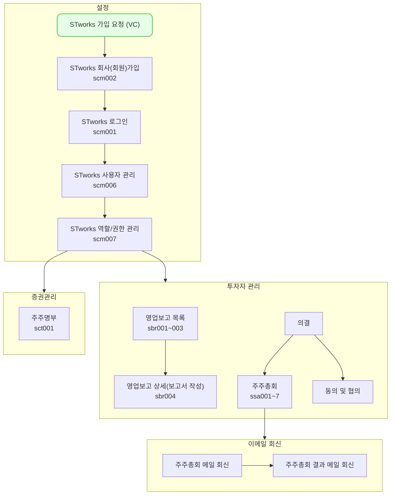

주주총회 메뉴에서는 정기/임시 주주총회를 등록하고, 회신한 응답을 바탕으로 의사록을 작성하여 결과를 전송하는 방법을 설명합니다.

## 동영상



## 설명
- `투자자 관리-주주총회`에서는 회사에서 개최할 주주총회의 안건 정보에 대해 기록할 수 있습니다.
- 등록된 안건 정보를 바탕으로 주주총회 소집 통지서를 자동 생성하여 시스템으로 주주에게 발송할 수 있습니다.
	- [tip] 주주총회 메뉴를 사용하시면, 주주총회 참석장, 서면 의결서, 위임장 등 필요 문서를 생성해줍니다!
- 주주의 회신 정보를 바탕으로 결과를 집계하고 의사록을 작성할 수 있습니다.

### 주주총회 관리
주주총회 메뉴에서 총회를 등록, 개최 및 관리하는 방법은 다음과 같습니다.

#### 주주총회 등록
1. `투자자 관리-주주총회`에서 `신규 등록` 버튼을 클릭해 주세요.
2. `주주총회 등록` 화면에서 주주총회 개최에 대한 개요 및 안건 정보를 작성해 주세요.
	- 기본 정보에는 주주총회 개최와 관련된 개요를 작성합니다.
	- 담당자 정보에는 주주총회와 관련된 문의 사항을 접수할 담당자의 연락처를 작성합니다.
		- [tip] 담당자 정보에 입력하는 정보는 주주총회 전송 시, 주주가 확인할 수 있는 정보입니다.
		- [tip] 주소 항목에는 법인 인감 증명서를 회신할 주소를 정확하게 입력해 주세요.
	- 안건 정보에는 해당 주주총회에서 진행할 부의 안건을 입력합니다.
		- `등기 여부` 스위치를 통해 해당 의안이 등기가 필요한 항목인지, 아닌지를 표시할 수 있습니다.
		- `구분`을 선택하시면, 각 안건별로 입력해야 하는 최소 항목의 가이드라인을 표 형식으로 제공합니다!
			- 최소 입력 사항 외에 추가로 작성해야 하는 사안이 있다면, 아래 글 상자에 작성해 주세요.
		- 해당 안건에 대해 추가로 주주가 확인해야 할 첨부파일이 있다면 `첨부파일` 항목에 첨부해 주세요.
3. [저장] 버튼을 클릭해 주세요.
4. `주주총회 상세` 화면에서 입력한 개최 정보를 확인해 주세요.

#### 주주총회 개최
1. `투자자 관리-주주총회`에서 개최하고자 하는 주주총회를 클릭해 주세요.
2. `주주명부 확정` 버튼을 클릭해 주주명부 탭으로 이동해 주세요.
3. 기준일을 선택 후, `확정` 버튼을 클릭해 주세요.
	- [tip] 정기 주주총회는 직전 결산기의 주주명부를 대상으로 합니다.
4. `기본정보` 탭 클릭 후, `주주에게 투표 요청`을 클릭해 주세요.
5. `투표 요청 모달`에서 전송에 필요한 정보를 입력해 주세요.

##### 전송에 필요한 정보
-  `검색`버튼을 클릭해 주주총회 개최 정보를 전송할 주주를 선택합니다.
	- [tip] 주주 연락처 목록에는 확정한 주주명부에 등록된 주주의 연락처 정보를 제공합니다.
		- 주주가 목록에서 보이지 않는 경우, `증권 관리-주주명부`메뉴에서 기준일의 주주명부를 수정해주세요.
		- 담당자 연락처가 보이지 않는 경우, `증권 관리-주주명부` 메뉴에서 해당 주주의 연락처 정보를 수정해 주세요.
- 주주총회 응답을 회신할 마감일과 시간을 설정합니다.
- `전송 문서`에서 주주에게 전송할 문서를 선택합니다.
	- [tip] 전송 문서에 대한 미리보기는 `관련 서류`탭 `총회 문서`에서 주주별로 조회할 수 있습니다.
	- [tip] 주주총회 등록 시 입력한 정보를 바탕으로 소집 통지서를 자동으로 생성해드립니다!
- `안내사항` 및 `첨부파일` 항목에 요청 시 주주가 추가로 확인해야 할 정보를 입력합니다.

5. `주주에게 전송` 버튼을 클릭해 주세요.
6. `전송 대상`에 지정한 연락처로 주주총회 개최 정보가 전송됩니다.
	- [tip] `전송 이력`탭에서 전송 성공 여부, 및 전송 일시 등 전송과 관련된 정보를 조회할 수 있습니다.

#### 주주총회 결과 회신 내역 확인

##### 주주의 회신 여부를 확인하는 경우
1. `투자자 관리-주주총회`에서 회신 여부를 확인하고자 하는 주주총회를 클릭해 주세요.
2. `주주명부 탭`을 클릭해 주세요.
3. `회신정보` 항목에서 해당 주주의 회신 여부를 확인할 수 있습니다.

##### 주주의 회신 문서를 확인하는 경우
1. `투자자 관리-주주총회`에서 회신 여부를 확인하고자 하는 주주총회를 클릭해 주세요.
2. `관련 서류 탭`을 클릭해 주세요.
3. `회신 문서`를 선택해 주세요.
4. 주주총회 개최 시 `전송 문서`에 선택했던 문서를 기준으로 주주가 회신한 문서를 확인할 수 있습니다.

##### 안건별로 주주의 회신 정보를 확인하는 경우
1. `투자자 관리-주주총회`에서 회신 여부를 확인하고자 하는 주주총회를 클릭해 주세요.
2. `기본정보 탭`에서 안건을 클릭해 주세요.
3. `주주별 응답 현황` 표에서 찬성/반대 및 기타 의견 정보를 확인할 수 있습니다.

#### 주주총회 의사록 작성
1. `투자자 관리-주주총회`에서 총회 의사록을 작성하고자 하는 주주총회를 클릭해 주세요.
2. `총회 의사록 탭`을 클릭해 주세요.
3. `주주총회 의사록`에 기입할 참석 등기 임원 및 의안별 결의사항을 작성해 주세요.
	- [tip] `의사록 열람` 버튼을 클릭해 입력한 내용을 바탕으로 의사록 어떻게 생성되는 지 확인할 수 있습니다.

##### 참석 등기 임원
1. `수정`버튼을 클릭해 주세요.
2. `+` 버튼을 클릭해 행을 추가합니다.
3. `이름` 항목의 셀렉트 박스를 클릭해 등기 임원을 선택해 주세요.
	- [tip] `설정-회사정보`에 등록된 우리 회사의 등기 임원 중 주주총회에 참석한 등기 임원을 선택합니다.
	- [tip] 참석 등기 임원 중, 해당 주주총회의 의장을 선택합니다. (최대 1명까지 지정 가능)

##### 의안별 결의사항
1. 표결현황을 바탕으로 의안의 통과 여부를 선택해 주세요.
	- [tip] 표결 현황은 주식 수를 기준으로 산정합니다.
	- [tip] 안건의 통과 여부는 결의 사항의 종류(특별 결의, 보통 결의) 및 정관을 바탕으로 선택해주세요!
2. 총회 결과에 대해 의사록에 기재할 결의 사항을 글 상자에 입력해 주세요.
3. `저장`버튼을 클릭해 주세요.
4. 위 프로세스를 모든 의안에서 진행해 주세요.

#### 주주총회 결과(의사록) 전송
- 주주총회 결과(의사록) 전송은 마감일이 지나 `진행상태`가 `투표 마감`인 주주총회를 대상으로 합니다.
- 결과 전송 전, `총회 의사록 탭`에서 참석 등기 임원 및 의안별 결의사항을 작성을 완료해 주세요!

1. `투자자 관리-주주총회`에서 결과를 전송하고자 하는 주주총회를 클릭해 주세요.
2. `총회 결과 전송` 버튼을 클릭해 주세요.
3. `결과 전송 모달`에서 결과 전송 시 필요한 정보를 입력해 주세요.

##### 결과 전송에 필요한 정보
- `검색` 버튼을 클릭해 주주총회 결과 및 의사록을 전송할 주주를 선택합니다.
- `의사록 열람` 버튼을 클릭해 주주에게 전송된 의사록을 미리 조회할 수 있습니다.
	- [tip] 의사록에 수정할 내용이 있는 경우, `총회 의사록 탭`에서 수정할 수 있습니다!
- `안내사항` 및 `첨부파일` 항목에 결과 전송 시 주주가 추가로 확인해야 할 정보를 입력합니다.

4. `주주에게 전송` 버튼을 클릭해 주세요.
5. `전송대상`에 지정한 연락처로 주주총회 결과 정보가 전송됩니다.
	- [tip] `전송 이력` 탭에서 전송 성공 여부 및 전송 일시 등 전송과 관련된 정보를 조회할 수 있습니다.

## [주주총회] 자주 묻는 질문
>주주총회 개최 정보를 수정하고 싶어요.
{: .prompt-tip }
- 개최 정보는 주주총회`진행상태`가 `임시저장`이거나, `투표전`인 경우, `내용 수정` 버튼을 통해 수정할 수 있습니다.
- 진행상태가 `투표중`인 경우, `요청 철회` 후 `내용 수정` 버튼을 통해 수정할 수 있습니다.
- 단, 철회 시 모든 주주를 대상으로 한 주주총회 요청이 철회되니, 주의해 주세요!

>확정한 주주명부를 수정하고 싶어요.
{: .prompt-tip }
- `주주명부 탭`에서 `확정 취소`버튼을 클릭한 후, `주주명부` 메뉴에서 주주명부를 수정해주세요.
- 주주총회 진행 상태가 `투표 전`인 경우에만 `확정 취소`할 수 있습니다.
- 주주총회 진행 상태가 `투표 중`인 경우, `철회`후 수정하실 수 있습니다.
- 주주명부 수정 후, `주주명부 탭`에서 수정된 주주명부를 확정해주세요.

>주주별로 응답한 내역을 조회하고 싶어요.
{: .prompt-tip }
- 주주별로 응답한 내역을 조회하는 기능은 추후 업데이트할 예정입니다.
- 안건별 응답 내역 조회를 이용해 주세요!

>주주의 응답 내용을 직접 입력할 수 있나요?
{: .prompt-tip }
- 주주의 응답 내용을 직접 입력할 수 있는 기능은 추후 업데이트 예정입니다.

>마감일을 연장하고 싶어요.
{: .prompt-tip }
- 진행상태가 `투표 중` 혹은 `마감`인 `주주총회 상세` 화면에서 `마감일 연장` 버튼을 통해 연장하실 수 있습니다.
- 단, 마감일은 현재일시 및 기존에 설정한 마감일 이후의 일자로만 연장이 가능합니다.

## 스타트업 업무의 일반 흐름

