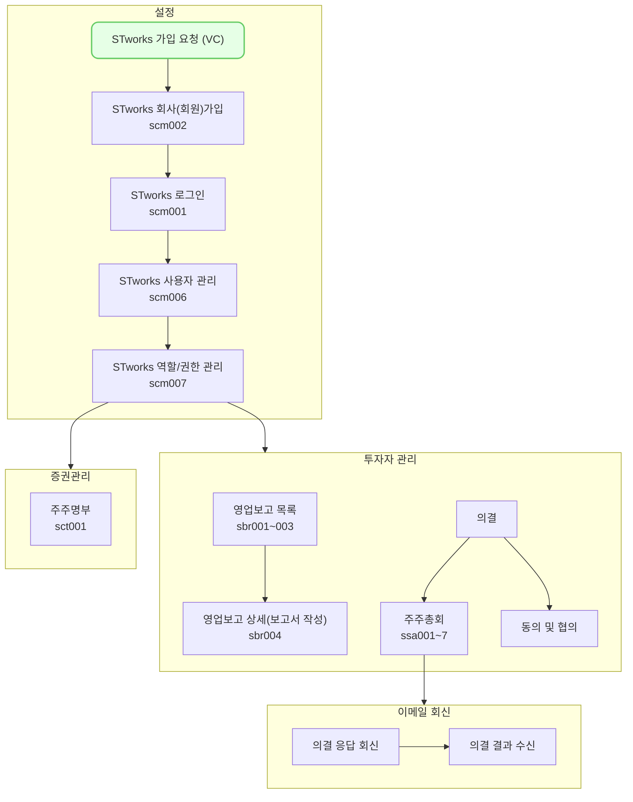

동의 및 협의 메뉴에서는 동의 사항 및 협의 사항을 등록하고, 회신한 응답을 바탕으로 주주에게 결과를 전송하는 방법을 설명합니다.

## 투어 가이드

### 동의 및 협의 등록 / 전송

<iframe src="https://app.supademo.com/embed/cmfql3k8g1050130upixwqz9o?embed_v=2&utm_source=embed" loading="lazy" title="동의 및 협의 등록 및 전송" allow="clipboard-write" frameborder="0" webkitallowfullscreen="true" mozallowfullscreen="true" allowfullscreen style="position: absolute; top: 0; left: 0; width: 100%; height: 100%;"></iframe>

### 동의 및 협의 결과 전송

<iframe src="https://app.supademo.com/embed/cmfucb7sj1czc10k8tp0coze4?embed_v=2&utm_source=embed" loading="lazy" title="동의 및 협의 결과 전송" allow="clipboard-write" frameborder="0" webkitallowfullscreen="true" mozallowfullscreen="true" allowfullscreen style="position: absolute; top: 0; left: 0; width: 100%; height: 100%;"></iframe>

## 설명
- `투자자 관리-동의 및 협의`에서는 주주의 동의 및 협의 사항에 대해 기록할 수 있습니다.
- 등록된 안건 정보를 바탕으로 주주에게 요청을 전송할 수 있습니다.
	- [tip] 동의 및 협의 메뉴에서는 공문, 서면 동의서, 위임장의 기본 템플릿을 제공합니다!
- 주주의 회신 정보를 바탕으로 결과를 집계하고 결과를 등록 및 전송할 수 있습니다.

### 동의 및 협의 사항 
동의 및 협의 메뉴를 사용하는 방법은 다음과 같습니다.

#### 동의 및 협의 등록
1. `투자자 관리-동의 및 협의`에서 `신규 등록` 버튼을 클릭해 주세요.
2. `동의 및 협의사항 등록` 화면에서 의결의 개요와 안건 정보를 작성해 주세요.
	- 기본 정보에는 동의 및 협의사항의 주요 안건을 중심으로 한 제목과 유형을 작성합니다.
	- 담당자 정보에는 의결과 관련된 문의 사항을 접수할 담당자의 연락처를 작성합니다.
		- [tip] 담당자 정보에 입력하는 정보는 응답 요청 시 주주가 확인할 수 있는 정보입니다.
		- [tip] 주소 항목에는 법인 인감 증명서를 회신할 주소를 정확하게 입력해 주세요.
	- 안건 정보에는 본 동의 및 협의사항 의결의 부의 안건을 입력합니다.
		- `등기 여부` 스위치를 통해 해당 안건이 등기가 필요한 항목인지, 아닌지를 표시할 수 있습니다.
		- `구분`을 선택하시면, 각 안건별로 입력해야 하는 최소 항목의 가이드라인을 표 형식으로 제공합니다!
			- 최소 입력 사항 외에 추가로 작성해야 하는 사안이 있다면, 아래 글 상자에 작성해 주세요.
		- 해당 안건에 대해 추가로 주주가 확인해야 할 첨부파일이 있다면 `첨부파일` 항목에 첨부해 주세요.
3. [저장] 버튼을 클릭해 주세요.
4. 상세 화면에서 입력한 개최 정보를 확인해 주세요.

#### 동의 및 협의 요청
1. `투자자 관리-동의 및 협의`에서 개최하고자 하는 행을 클릭해 주세요.
2. `대상 주주 선택` 버튼을 클릭해 주주명부 탭으로 이동해 주세요.
3. 기준일을 선택 후, `확정` 버튼을 클릭해 주세요.
4. 해당 주주명부에서 의사 결정 대상인 주주를 선택하신 후, `선택 완료` 버튼을 클릭해 주세요.
5. `기본정보` 탭 클릭 후, `주주에게 의견 요청`을 클릭해 주세요.
6. `주주 의견 요청` 모달에서 전송에 필요한 정보를 입력해 주세요.

##### 전송에 필요한 정보
-  `검색`버튼을 클릭해 메일 및 시스템으로 의견 요청을 보낼 주주를 선택합니다.
	- [tip] 주주 연락처 목록에는 확정한 주주명부에 등록된 주주의 연락처 정보를 제공합니다.
		- 주주가 목록에서 보이지 않는 경우, `증권 관리-주주명부`메뉴에서 기준일의 주주명부를 수정해주세요.
		- 담당자 연락처가 보이지 않는 경우, `증권 관리-주주명부` 메뉴에서 해당 주주의 연락처 정보를 수정해 주세요.
- 응답을 회신할 마감일과 시간을 설정합니다.
- `전송 문서`에서 주주에게 전송할 문서를 선택합니다.
	- [tip] 전송 문서에 대한 미리보기는 `관련 서류`탭 `발송 문서`에서 주주별로 조회할 수 있습니다.
- `안내사항` 및 `첨부파일` 항목에 요청 시 주주가 추가로 확인해야 할 정보를 입력합니다.

7. `주주에게 전송` 버튼을 클릭해 주세요.
8. `전송 대상`에 선택한 연락처로 주주총회 개최 정보가 전송됩니다.
	- [tip] `전송 이력`탭에서 전송 성공 여부, 및 전송 일시 등 전송과 관련된 정보를 조회할 수 있습니다.

#### 동의 및 협의 결과 회신 내역 확인

##### 주주의 회신 여부를 확인하는 경우
1. `투자자 관리-동의 및 협의`에서 회신 여부를 확인하고자 하는 행을 클릭해 주세요.
2. `주주명부 탭`을 클릭해 주세요.
3. `회신정보` 항목에서 해당 주주의 회신 여부를 확인할 수 있습니다.

##### 주주의 회신 문서를 확인하는 경우
1. `투자자 관리-동의 및 협의`에서 회신 문서를 확인하고자 하는 행을 클릭해 주세요.
2. `관련 서류 탭`을 클릭해 주세요.
3. `회신 문서`를 선택해 주세요.
4. 의견 요청 시 `전송 문서`에 선택했던 문서를 기준으로 주주가 공문 및 위임장을 확인할 수 있습니다.

##### 안건별로 주주의 회신 문서를 확인하는 경우
1. `투자자 관리-동의 및 협의`에서 회신 문서를 확인하고자 하는 행을 클릭해 주세요.
2. `기본정보 탭`에서 안건을 클릭해 주세요.
3. `주주별 응답 현황` 표에서 찬성/반대 및 기타 의견 정보를 확인할 수 있습니다.

#### 동의 및 협의 사항 결과 등록
1. `투자자 관리-동의 및 협의`에서 응답 마감일이 지나 결과를 등록하고자 하는 행을 클릭해 주세요.
2. `기본 정보 탭`을 클릭해 주세요.
3. 안건별로 `결과 등록` 버튼을 클릭해 통과/기각을 선택해 주세요.

#### 동의 및 협의 결과 전송
- 결과 전송은 마감일이 지나 `진행상태`가 `응답 마감`인 동의 및 협의 사항을 대상으로 합니다.
- 결과 전송 전, `기본 정보 탭`에서 안건별 결과 등록 작업을 진행해주세요!

1. `투자자 관리-동의 및 협의`에서 결과를 전송하고자 하는 행을 클릭해 주세요.
2. `결과 전송` 버튼을 클릭해 주세요.
3. `결과 전송 모달`에서 결과 전송 시 필요한 정보를 입력해 주세요.

##### 결과 전송에 필요한 정보
- `검색` 버튼을 클릭해 메일 및 시스템으로 동의 및 협의 결과를 전송할 주주를 선택합니다.
- `안내사항` 및 `첨부파일` 항목에 결과 전송 시 주주가 추가로 확인해야 할 정보를 입력합니다.

4. `주주에게 전송` 버튼을 클릭해 주세요.
5. `전송대상`에 지정한 연락처로 안건별 결과 정보가 전송됩니다.
	- [tip] `전송 이력` 탭에서 전송 성공 여부 및 전송 일시 등 전송과 관련된 정보를 조회할 수 있습니다.

## [동의 및 협의] 자주 묻는 질문
>안건 정보를 수정하고 싶어요.
{: .prompt-tip }
- 안건 정보는 `진행상태`가 `임시저장`이거나, `투표전`인 경우, `내용 수정` 버튼을 통해 수정할 수 있습니다.
- 진행상태가 `투표중`인 경우, `요청 철회` 후 `내용 수정` 버튼을 통해 수정할 수 있습니다.
- 단, 철회 시 모든 주주를 대상으로 한 응답 요청이 철회되니, 주의해 주세요!

>확정한 주주명부를 수정하고 싶어요.
{: .prompt-tip }
- `주주명부 탭`에서 `다시 선택` > `확정 취소`버튼을 클릭한 후, 주주명부를 수정해주세요.
- 주주총회 진행 상태가 `투표 전`인 경우에만 취소 후 수정할 수 있습니다.
- 주주총회 진행 상태가 `투표 중`인 경우, `철회`후 수정하실 수 있습니다.
- 주주명부 수정 후, `주주명부 탭`에서 수정된 주주명부를 확정해주세요.

>마감일을 연장하고 싶어요.
{: .prompt-tip }
- 진행상태가 `투표 중` 혹은 `마감`인 경우에만 마감일 연장이 가능합니다.
- `마감일 연장` 버튼을 클릭해 연장 마감일시를 지정해주세요.
- 단, 마감일은 현재일시 및 기존에 설정한 마감일 이후의 일자로만 연장이 가능합니다.

## 스타트업 업무의 일반 흐름

