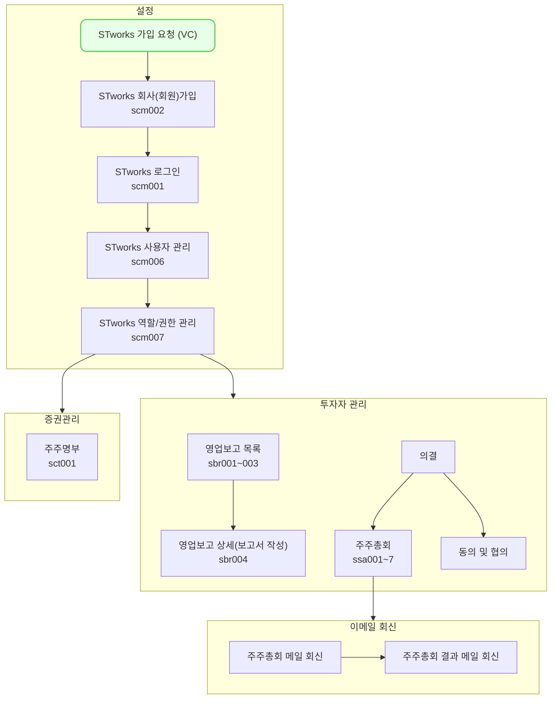

주주총회 메일 회신에서는 주식회사에서 보낸 주주총회 내용을 회신하고, 이에 대한 의견을 회신하는 방법을 설명합니다.

## 동영상



## 설명
- `주주총회 메일 회신`에서는 주식회사에서 보낸 주주총회 개요 및 안건 내용을 조회할 수 있습니다.
- 각 안건에 대해 찬성/반대 의사를 행사하고, 추가 의견을 작성한 내역을 주식회사에 회신할 수 있습니다.

#### 주주총회 세부 내역(개요 및 안건) 조회
주식회사가 요청한 주주총회 세부 내역을 조회하는 방법은 다음과 같습니다.

1. 주식회사에서 요청한 메일을 확인합니다.
2. `의견서 작성` 버튼을 클릭합니다.
3. 코드 인증 화면에 접속합니다.
4. `식별 코드 요청(05:00)`버튼을 클릭합니다.
5. 이메일로 회신한 식별 코드를 입력합니다.
6. `상세 내용 조회` 버튼을 클릭합니다.
7. 주주총회와 관련된 내용을 조회합니다.
	- [tip] 소집통지서 등 총회와 관련된 문서는 의견 회신 화면에서 조회 및 다운로드 하실 수 있습니다.
	- [tip] 주주명이나 주식 수와 관련된 정보가 잘못 기입되어 있는 경우, 요청한 회사에 직접 문의해주세요.

#### 주주총회 의견 회신
주식회사가 요청한 안건에 대한 찬성/반대 의사를 행사하고, 추가 의견을 작성하는 방법은 다음과 같습니다.

1. 주식회사에서 요청한 메일을 확인합니다.
2. `의견서 작성` 버튼을 클릭합니다.
3. 코드 인증 화면에 접속합니다.
4. `식별 코드 요청(05:00)`버튼을 클릭합니다.
5. 이메일로 회신한 식별 코드를 입력합니다.
6. `의견서 작성` 버튼을 클릭합니다.
7. 의견서 작성 화면에 접속합니다.
	- [tip] `안내사항 보기` 링크 혹은 버튼을 클릭하면, 해당 주주총회 요청 시 주식회사에서 입력한 안내사항 및 주주총회 담당자 정보를 조회하실 수 있습니다.
8. 소집 통지서와 관련된 문서를 확인합니다.

##### 주주총회 관련 문서
- 대리인을 통해 의견을 행사하는 경우 `의결권 위임장`의 수임인 정보를 입력해주세요.
	1. `수임인 정보 입력` 버튼을 클릭합니다.
	2. 수임인의 이름, 생년월일, 주소를 입력합니다.
	3. `저장` 버튼을 클릭합니다.
	4. `미리보기` 버튼을 클릭해 위임장에 작성된 내역을 미리보기 합니다.
- 주식회사에서 소집 기간을 단축 했거나, 소집 통지를 생략한 경우 관련 동의서에 `동의`해주세요.

9. `첨부` 버튼을 클릭해 관련 문서에 삽입할 도장을 첨부해주세요.
10. `다음` 버튼을 클릭해 주세요.
11. 안건에 대한 찬성/반대 및 추가 의견을 입력해 주세요.
	- [tip] 하단 `안건 상세 내용 보기`를 클릭하시면, 해당 안건에 대한 구체적인 정보를 확인하실 수 있습니다.
12. 모든 안건에 대한 의견을 작성하신 경우, `제출`버튼을 클릭해 주세요.
13. 주주총회에 대한 의견 회신이 완료됩니다.
	- [tip] 재응답이 필요한 경우, 동일한 프로세스를 통해 회신해주시면 됩니다.

## [주주총회 메일 회신] 자주 묻는 질문

> 메일에서 `의견서 작성` 버튼을 클릭했는데, 마감/철회되었다는 안내 문구가 나옵니다. 
{: .prompt-tip }
- 주식회사에서 설정한 회신 마감일이 지난 경우, 마감되었다는 문구가 제공될 수 있습니다.
- 주식회사에서 안건 정보 수정 등의 사유로 요청을 철회한 경우 철회되었다는 문구가 제공될 수 있습니다.
- 마감일 연장 및 재요청은 주식회사에 직접 문의해주세요!
	- [tip] `안내 사항 보기` 버튼을 클릭하시면, 주주총회 담당자 정보를 조회하실 수 있습니다.

## 스타트업 업무의 일반 흐름

