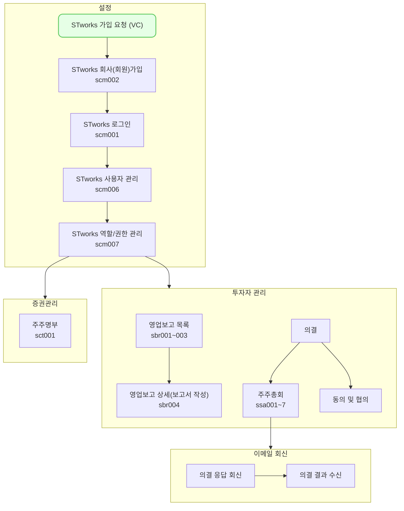

의결 결과 수신에서는 주식회사에서 보낸 의결의 결과 및 의사록을 조회하는 방법을 설명합니다.

## 투어 가이드

<iframe src="https://app.supademo.com/embed/cmfqj1v6d0y0u130ux9ccr0tf?embed_v=2&utm_source=embed" loading="lazy" title="주주총회 결과 메일 회신" allow="clipboard-write" frameborder="0" webkitallowfullscreen="true" mozallowfullscreen="true" allowfullscreen style="position: absolute; top: 0; left: 0; width: 100%; height: 100%;"></iframe>

## 설명
- `의결 결과 수신`에서는 주식회사에서 보낸 의결의 결과를 조회하거나 의사록을 조회할 수 있습니다.
#### 의결 결과 및 의사록 조회
주식회사가 회신한 의결의 결과를 조회하는 방법은 다음과 같습니다.

1. 주식회사에서 전송한 메일을 확인합니다.
2. `주주총회 결과 보기` 버튼을 클릭합니다.
3. 코드 인증 화면에 접속합니다.
4. `식별 코드 요청(05:00)`버튼을 클릭합니다.
5. 이메일로 회신한 식별 코드를 입력합니다.
6. `결과 보기` 버튼을 클릭합니다.
7. 의결 결과 및 의사록을 조회합니다.
	- [tip] 주주총회인 경우 의사록이 함께 제공됩니다.
	- [tip] `안내사항 보기` 링크 혹은 버튼을 클릭하면, 주식회사에서 입력한 안내사항 및 주주총회 담당자 정보를 조회하실 수 있습니다.

## 스타트업 업무의 일반 흐름

