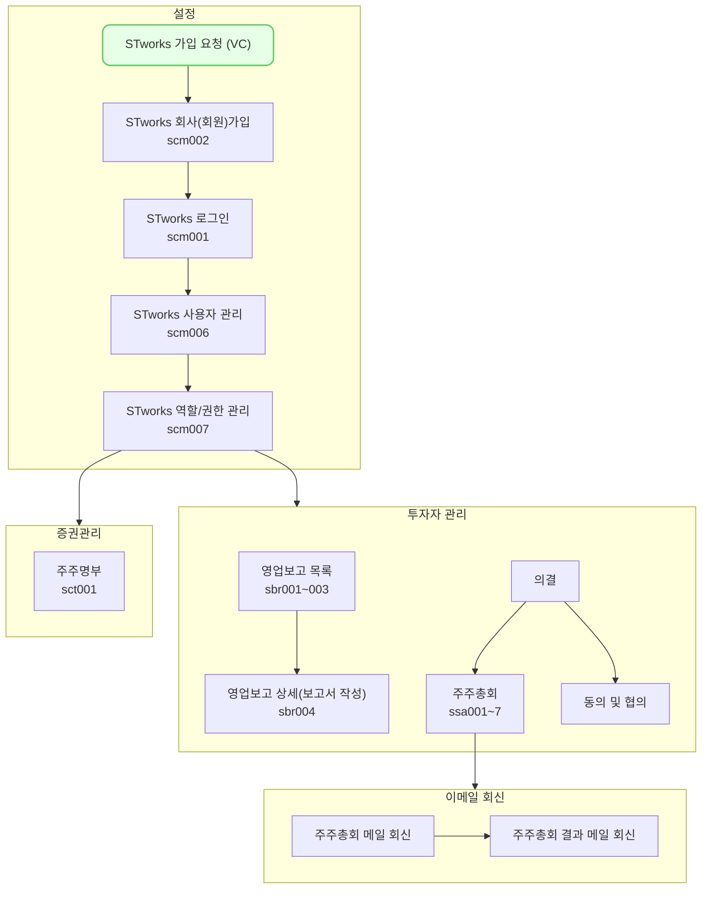

---
# the default layout is 'page'
icon: fas fa-info-circle
order: 1
mermaid: true
---

STworks.kr은 똑똑[^dkdk] 주식회사에서 만든 스타트업 영업보고(투자자보고) 시스템입니다.

## 스타트업 업무의 일반 흐름
원하는 메뉴를 클릭하시면 해당 매뉴얼로 이동합니다.

버그 및 문의 사항은 다음 이메일로 보내주세요: **[we@ddock.kr](mailto:we@ddock.kr)**

---

[^dkdk]:똑똑(ddock.kr)은 대한민국 벤처투자전문회사인 DSC인베스트먼트가 VC업계의 업무 방식을 혁신하고자 만든 IT자회사입니다. 
